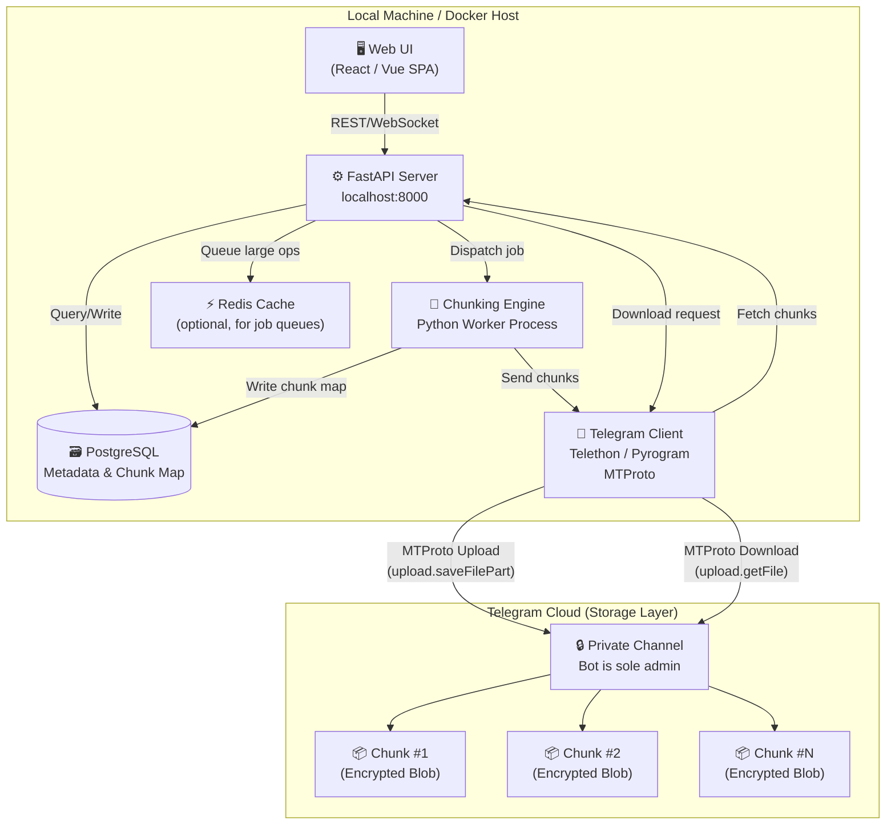

# MASTER PROJECT DOCUMENT
# TeleVault — Secure Private Cloud Storage via Telegram Backend

> **Document Role:** This is the canonical baseline for all AI agents, sub-agents, and skills working on this project. All UI, API, database, and infrastructure agents must treat this file as the **single source of truth**. Sections marked `[AGENT HANDOFF]` contain explicit instructions for downstream skill agents.

---

## Table of Contents

1. [Project Overview & Objectives](#1-project-overview--objectives)
2. [System Architecture](#2-system-architecture)
3. [Core Workflows](#3-core-workflows)
   - 3.1 [Upload & Chunking Pipeline](#31-upload--chunking-pipeline)
   - 3.2 [Download & Stitching Pipeline](#32-download--stitching-pipeline)
   - 3.3 [Search & Metadata Resolution](#33-search--metadata-resolution)
4. [Tech Stack & Dependencies](#4-tech-stack--dependencies)
5. [Database Schema](#5-database-schema)
6. [API Endpoints Outline](#6-api-endpoints-outline)
7. [Security Model](#7-security-model)
8. [Edge Cases & Mitigations](#8-edge-cases--mitigations)
9. [Docker & Deployment](#9-docker--deployment)
10. [UI/UX Design Directives](#10-uiux-design-directives)
11. [Inter-Skill Compatibility Contract](#11-inter-skill-compatibility-contract)
12. [Glossary](#12-glossary)

---

## 1. Project Overview & Objectives

### 1.1 What Is TeleVault?

TeleVault is a **self-hosted, private cloud storage system** where Telegram acts as the raw byte storage layer. Users interact exclusively through a local web application; Telegram itself is never accessed directly by the end user for file operations. All files uploaded to Telegram are **unrecognizable, encrypted, and fragmented** — they have no value without the local system to reconstruct them.

### 1.2 Core Design Principles

| Principle | Implementation |
|---|---|
| **Zero Trust on Telegram** | Files are never uploaded in their original form. Telegram stores only encrypted, nameless chunks. |
| **Local Sovereignty** | All metadata, chunk maps, encryption keys, and search indexes reside on the local machine — never in the cloud. |
| **Full Reconstruction Locally** | Downloads are assembled and decrypted exclusively by the local app. A raw Telegram dump is forensically useless. |
| **Fast Search Without Round-Trips** | File searches never query Telegram. The local PostgreSQL/SQLite database is the search authority. |
| **Container-Native** | All services are Dockerized and deployable to Kamatera, GCP Compute Engine, or any VPS provider. |

### 1.3 Objectives

- Store an **unlimited number of files** (subject to Telegram's own storage limits, which are effectively uncapped for bots).
- Guarantee that **a breach of Telegram credentials alone cannot expose user files**.
- Support files of any type and size via transparent chunking.
- Deliver a **fast, responsive local web UI** for browsing, searching, uploading, and downloading.
- Enable **tag-based and full-text search** against local metadata with sub-100ms response times.

---

## 2. System Architecture

### 2.1 High-Level Flow Diagram

```
┌──────────────────────────────────────────────────────────────┐
│                      LOCAL MACHINE / SERVER                   │
│                                                              │
│  ┌──────────────┐        ┌───────────────────────────────┐  │
│  │   Browser UI  │◄──────►│      FastAPI Backend (API)    │  │
│  │  (React/Vue)  │  HTTP  │  /upload /download /search    │  │
│  └──────────────┘        └──────────┬────────────────────┘  │
│                                     │                        │
│                           ┌─────────▼──────────┐            │
│                           │  Chunking Engine   │            │
│                           │  (Python Worker)   │            │
│                           │  - AES-256 Encrypt  │            │
│                           │  - Split Chunks     │            │
│                           │  - HMAC Tag         │            │
│                           └────┬──────────┬────┘            │
│                                │          │                  │
│                    ┌───────────▼──┐  ┌────▼──────────────┐  │
│                    │  PostgreSQL  │  │   Telethon/        │  │
│                    │  (Metadata + │  │   Pyrogram Client  │  │
│                    │   Chunk Map) │  │   (MTProto Layer)  │  │
│                    └─────────────┘  └────────────────────┘  │
│                                                              │
└─────────────────────────────────────┬────────────────────────┘
                                      │ MTProto / Bot API (TLS)
                              ┌───────▼────────┐
                              │ TELEGRAM CLOUD │
                              │  Private Chanel│
                              │  [RAW CHUNKS]  │
                              │  (Useless alone│
                              └────────────────┘
```

### 2.2 Mermaid.js Architecture Diagram



### 2.3 Component Responsibilities

| Component | Technology | Responsibility |
|---|---|---|
| **Web UI** | React 18 + TailwindCSS | User-facing interface for all operations |
| **FastAPI Server** | Python 3.11 + FastAPI | REST API, WebSocket progress, orchestration |
| **Chunking Engine** | Python (asyncio worker) | Encrypt → split → HMAC tag → queue |
| **Telegram Client** | Telethon 1.x (MTProto) | Upload/download chunks to private channel |
| **Metadata DB** | PostgreSQL 15 / SQLite 3 | File index, chunk maps, search tags |
| **Job Queue** | Redis + ARQ (optional) | Background task management for large files |

---

## 3. Core Workflows

### 3.1 Upload & Chunking Pipeline

```
┌─────────────────────────────────────────────────────────────────┐
│                    UPLOAD PIPELINE (Detailed)                    │
└─────────────────────────────────────────────────────────────────┘

User selects file in UI
         │
         ▼
[1] PRE-PROCESSING (FastAPI + Python)
    ├── Assign internal UUID (file_id)
    ├── Record original_name, mime_type, size, upload_timestamp
    ├── Derive a unique 256-bit AES key (per-file, via secrets.token_bytes(32))
    └── Derive a 256-bit HMAC key (separate, via secrets.token_bytes(32))
         │
         ▼
[2] CHUNKING
    ├── Read file as raw bytes
    ├── Split into N chunks of target_chunk_size (default: 1.5 MB)
    │   └── Last chunk padded with PKCS7 if needed
    ├── Each chunk assigned: chunk_index (0-based), chunk_uuid
    └── Store: total_chunks = N
         │
         ▼
[3] ENCRYPTION (per chunk)
    ├── Generate random 128-bit IV per chunk
    ├── Encrypt: AES-256-CBC(chunk_bytes, key=file_aes_key, iv=chunk_iv)
    ├── Append HMAC-SHA256(encrypted_bytes, hmac_key) → 32-byte tag
    └── Final blob = IV(16B) + HMAC(32B) + Ciphertext(variable)
         │
         ▼
[4] OBFUSCATION (optional hardening)
    ├── Rename blob to random hex filename (no extension)
    ├── Upload as generic "document" type, NOT by original extension
    └── Optionally shuffle upload order (upload chunk 3, 0, 7, 1... not sequential)
         │
         ▼
[5] TELEGRAM UPLOAD (Telethon)
    ├── For each encrypted blob:
    │   ├── client.send_file(channel, blob, caption="")
    │   ├── Receive: telegram_message_id, telegram_file_id
    │   └── Retry on FloodWaitError with exponential backoff
    └── All uploads complete → collect (chunk_index → telegram_message_id) map
         │
         ▼
[6] METADATA PERSISTENCE (PostgreSQL)
    ├── INSERT INTO files (file_id, original_name, mime_type, size, ...)
    ├── INSERT INTO encryption_keys (file_id, aes_key_enc, hmac_key_enc, iv_map)
    │   └── Keys stored encrypted with master password (Argon2id-derived KEK)
    ├── INSERT INTO chunks (chunk_id, file_id, chunk_index, telegram_msg_id, ...)
    │   └── One row per chunk
    └── INSERT INTO search_tags (file_id, tag) for each user-supplied tag
         │
         ▼
[7] SIGNAL UI: upload complete
    └── WebSocket event → progress bar → "File stored securely"
```

**Chunk Size Strategy:**

| File Size | Chunk Size | Rationale |
|---|---|---|
| < 10 MB | 512 KB | Avoids Telegram small-file overhead |
| 10 MB – 1 GB | 1.5 MB | Below Telegram Bot API 2 MB per-message limit |
| > 1 GB | 4 MB | Use MTProto directly (Telethon), avoids Bot API limits |

> **CRITICAL:** Telegram Bot API max document size is 50 MB per send. For files > 50 MB, use Telethon's MTProto `upload.saveFilePart` directly, which supports up to 2 GB per file object.

---

### 3.2 Download & Stitching Pipeline

```
┌─────────────────────────────────────────────────────────────────┐
│                   DOWNLOAD PIPELINE (Detailed)                   │
└─────────────────────────────────────────────────────────────────┘

User requests file by file_id in UI
         │
         ▼
[1] METADATA LOOKUP (Local DB — NO Telegram query yet)
    ├── SELECT * FROM files WHERE file_id = ?
    ├── SELECT * FROM chunks WHERE file_id = ? ORDER BY chunk_index ASC
    ├── SELECT aes_key_enc, hmac_key_enc FROM encryption_keys WHERE file_id = ?
    └── Decrypt keys using KEK (derived from master password / session token)
         │
         ▼
[2] CHUNK RETRIEVAL (Telethon — Parallel where safe)
    ├── For each chunk row (ordered by chunk_index):
    │   ├── messages.get_messages(channel_id, ids=[telegram_msg_id])
    │   ├── Download attached document bytes (in-memory, never disk)
    │   └── Retry on network errors (max 5 attempts)
    └── All chunks in memory as dict {chunk_index: encrypted_blob}
         │
         ▼
[3] INTEGRITY VERIFICATION (per chunk)
    ├── Extract IV (first 16 bytes) and HMAC tag (next 32 bytes) from blob
    ├── Recompute HMAC-SHA256(ciphertext, hmac_key)
    ├── Constant-time compare → FAIL if mismatch → abort, alert user
    └── PASS → proceed to decryption
         │
         ▼
[4] DECRYPTION (per chunk)
    ├── AES-256-CBC decrypt(ciphertext, key=aes_key, iv=chunk_iv)
    ├── Remove PKCS7 padding from last chunk only
    └── Collect: {chunk_index: plaintext_bytes}
         │
         ▼
[5] STITCHING
    ├── Sort by chunk_index (0 → N-1)
    ├── Concatenate plaintext_bytes sequentially
    └── Verify total byte length == files.size (reject if mismatch)
         │
         ▼
[6] DELIVERY
    ├── Stream reconstructed bytes to browser via FastAPI StreamingResponse
    ├── Set headers: Content-Disposition: attachment; filename="original_name"
    ├── Set headers: Content-Type: <original mime_type>
    └── Optional: serve via temporary signed URL for large files
```

---

### 3.3 Search & Metadata Resolution

```
Search Query (user types in UI)
         │
         ▼
[1] FastAPI receives GET /api/files/search?q=<term>&tags=<csv>
         │
         ▼
[2] PostgreSQL Full-Text Search
    ├── SELECT files.* FROM files
    │   LEFT JOIN search_tags ON files.file_id = search_tags.file_id
    │   WHERE to_tsvector('english', files.original_name || ' ' || COALESCE(search_tags.tag,''))
    │         @@ plainto_tsquery('english', :q)
    │   AND (:tags IS NULL OR search_tags.tag = ANY(:tags))
    │   ORDER BY files.upload_timestamp DESC
    │   LIMIT 50
    └── Returns: file_id, name, size, mime, tags, upload_date
         │
         ▼
[3] API returns paginated JSON → UI renders file cards
    └── NO TELEGRAM QUERIES INVOLVED IN SEARCH
```

---

## 4. Tech Stack & Dependencies

### 4.1 Backend (Python)

```toml
# pyproject.toml / requirements.txt equivalents

[core]
python = "^3.11"
fastapi = "^0.111.0"          # REST API framework
uvicorn = {extras=["standard"], version="^0.29.0"}  # ASGI server
telethon = "^1.36.0"           # Telegram MTProto client (preferred)
pyrogram = "^2.0.106"          # Alternative Telegram client (fallback)
pycryptodome = "^3.20.0"       # AES-256-CBC, HMAC-SHA256
cryptography = "^42.0.0"       # Argon2id key derivation (via argon2-cffi)
argon2-cffi = "^23.1.0"        # Master password → KEK derivation

[database]
sqlalchemy = {extras=["asyncio"], version="^2.0.0"}  # ORM
asyncpg = "^0.29.0"            # Async PostgreSQL driver
aiosqlite = "^0.20.0"          # Async SQLite driver (dev/lightweight mode)
alembic = "^1.13.0"            # Database migrations

[task-queue]
arq = "^0.25.0"                # Redis-backed async task queue
redis = {extras=["hiredis"], version="^5.0.0"}

[utilities]
python-multipart = "^0.0.9"   # File upload parsing
aiofiles = "^23.2.0"           # Async file I/O
pydantic = "^2.7.0"            # Request/response validation
pydantic-settings = "^2.2.0"  # .env config management
structlog = "^24.1.0"          # Structured logging
httpx = "^0.27.0"              # Async HTTP client (internal calls)

[dev]
pytest = "^8.1.0"
pytest-asyncio = "^0.23.0"
pytest-cov = "^5.0.0"
ruff = "^0.4.0"                # Linter + formatter
mypy = "^1.9.0"
```

### 4.2 Frontend (Web UI)

```json
{
  "dependencies": {
    "react": "^18.3.0",
    "react-dom": "^18.3.0",
    "react-router-dom": "^6.23.0",
    "axios": "^1.7.0",
    "zustand": "^4.5.0",
    "tailwindcss": "^3.4.0",
    "@tanstack/react-query": "^5.37.0",
    "lucide-react": "^0.383.0",
    "react-dropzone": "^14.2.0",
    "react-hot-toast": "^2.4.0",
    "bytes": "^3.1.2"
  },
  "devDependencies": {
    "vite": "^5.2.0",
    "@vitejs/plugin-react": "^4.2.0",
    "autoprefixer": "^10.4.19",
    "postcss": "^8.4.38"
  }
}
```

### 4.3 Infrastructure

| Tool | Version | Purpose |
|---|---|---|
| Docker Engine | 26.x | Container runtime |
| Docker Compose | 2.x | Local multi-service orchestration |
| PostgreSQL | 15-alpine | Primary metadata database |
| Redis | 7-alpine | Job queue broker (optional) |
| Nginx | 1.25-alpine | Reverse proxy + SSL termination |
| Certbot | latest | Auto TLS (for VPS deployments) |

### 4.4 Environment Variables (`.env` Template)

```dotenv
# ─── Application ───────────────────────────────
APP_ENV=production                      # development | production
APP_SECRET_KEY=<64-char-random-hex>     # Session signing key
APP_MASTER_PASSWORD_HASH=<argon2-hash>  # Hashed master password for KEK

# ─── Telegram ──────────────────────────────────
TELEGRAM_API_ID=<your_api_id>
TELEGRAM_API_HASH=<your_api_hash>
TELEGRAM_SESSION_STRING=<base64-session>
TELEGRAM_STORAGE_CHANNEL_ID=<-100xxxxxxxxxx>
TELEGRAM_BOT_TOKEN=<optional-bot-token>  # Only if using Bot API fallback

# ─── Database ──────────────────────────────────
DATABASE_URL=postgresql+asyncpg://televault:secret@db:5432/televault
# For SQLite (dev): DATABASE_URL=sqlite+aiosqlite:///./televault.db

# ─── Redis (optional) ──────────────────────────
REDIS_URL=redis://redis:6379/0

# ─── Chunking ──────────────────────────────────
CHUNK_SIZE_BYTES=1572864               # 1.5 MB default
MAX_PARALLEL_CHUNK_UPLOADS=3          # Respect Telegram rate limits
UPLOAD_RETRY_MAX=5
UPLOAD_RETRY_BACKOFF_BASE=2           # Exponential: 2^attempt seconds

# ─── Storage ───────────────────────────────────
TEMP_DIR=/tmp/televault                # Ephemeral staging (auto-cleaned)
```

---

## 5. Database Schema

> **Design rule:** All keys stored in the DB are encrypted with the KEK. The KEK is derived from the master password via Argon2id and never persisted. If the master password is lost, all files are permanently inaccessible.

### 5.1 Schema DDL (PostgreSQL)

```sql
-- ── Extensions ────────────────────────────────────────────────────
CREATE EXTENSION IF NOT EXISTS "uuid-ossp";
CREATE EXTENSION IF NOT EXISTS "pg_trgm";   -- Trigram index for fuzzy search


-- ── Table: files ──────────────────────────────────────────────────
-- One row per logical file the user has uploaded.
CREATE TABLE files (
    file_id         UUID PRIMARY KEY DEFAULT uuid_generate_v4(),
    original_name   TEXT        NOT NULL,               -- e.g. "project.zip"
    mime_type       TEXT        NOT NULL DEFAULT 'application/octet-stream',
    size_bytes      BIGINT      NOT NULL,               -- Original unencrypted size
    total_chunks    INTEGER     NOT NULL,
    upload_status   TEXT        NOT NULL DEFAULT 'pending',
                                -- pending | uploading | complete | failed
    upload_started  TIMESTAMPTZ NOT NULL DEFAULT NOW(),
    upload_finished TIMESTAMPTZ,
    description     TEXT,
    is_deleted      BOOLEAN     NOT NULL DEFAULT FALSE, -- Soft delete
    deleted_at      TIMESTAMPTZ,

    -- Full-text search vector (auto-updated by trigger)
    search_vector   TSVECTOR GENERATED ALWAYS AS (
        to_tsvector('english', original_name || ' ' || COALESCE(description, ''))
    ) STORED
);

CREATE INDEX idx_files_search ON files USING GIN(search_vector);
CREATE INDEX idx_files_status ON files(upload_status);
CREATE INDEX idx_files_deleted ON files(is_deleted) WHERE is_deleted = FALSE;
CREATE INDEX idx_files_upload_time ON files(upload_started DESC);


-- ── Table: encryption_keys ────────────────────────────────────────
-- Stores per-file encryption material, itself encrypted with KEK.
CREATE TABLE encryption_keys (
    key_id          UUID PRIMARY KEY DEFAULT uuid_generate_v4(),
    file_id         UUID        NOT NULL REFERENCES files(file_id) ON DELETE CASCADE,

    -- AES-256 key for this file, encrypted with master KEK
    -- Stored as: AES-256-CBC(raw_aes_key, kek, kek_iv) → base64
    aes_key_enc     TEXT        NOT NULL,

    -- HMAC-SHA256 key for this file, encrypted with master KEK
    hmac_key_enc    TEXT        NOT NULL,

    -- KEK derivation parameters (Argon2id)
    kek_salt        BYTEA       NOT NULL,              -- 32 random bytes
    kek_time_cost   INTEGER     NOT NULL DEFAULT 2,
    kek_memory_cost INTEGER     NOT NULL DEFAULT 65536, -- 64 MB
    kek_parallelism INTEGER     NOT NULL DEFAULT 2,

    created_at      TIMESTAMPTZ NOT NULL DEFAULT NOW(),

    CONSTRAINT uq_enckey_file UNIQUE (file_id)
);


-- ── Table: chunks ─────────────────────────────────────────────────
-- One row per chunk per file. Maps chunk order → Telegram location.
CREATE TABLE chunks (
    chunk_id            UUID PRIMARY KEY DEFAULT uuid_generate_v4(),
    file_id             UUID        NOT NULL REFERENCES files(file_id) ON DELETE CASCADE,
    chunk_index         INTEGER     NOT NULL,           -- 0-based sequential index
    telegram_message_id BIGINT      NOT NULL,           -- Message ID in storage channel
    telegram_file_id    TEXT,                          -- TG file_id (for direct access)
    telegram_access_hash BIGINT,                       -- Required for MTProto access
    size_bytes          INTEGER     NOT NULL,           -- Encrypted chunk size
    iv_hex              CHAR(32)    NOT NULL,           -- 16-byte IV as 32-char hex
    upload_status       TEXT        NOT NULL DEFAULT 'pending',
                                -- pending | uploaded | failed
    uploaded_at         TIMESTAMPTZ,
    retry_count         INTEGER     NOT NULL DEFAULT 0,

    CONSTRAINT uq_chunk_order UNIQUE (file_id, chunk_index)
);

CREATE INDEX idx_chunks_file ON chunks(file_id);
CREATE INDEX idx_chunks_tg_msg ON chunks(telegram_message_id);


-- ── Table: search_tags ────────────────────────────────────────────
-- Normalized tag table for multi-tag filtering.
CREATE TABLE search_tags (
    tag_id      UUID PRIMARY KEY DEFAULT uuid_generate_v4(),
    file_id     UUID        NOT NULL REFERENCES files(file_id) ON DELETE CASCADE,
    tag         TEXT        NOT NULL,
    created_at  TIMESTAMPTZ NOT NULL DEFAULT NOW(),

    CONSTRAINT uq_file_tag UNIQUE (file_id, tag)
);

CREATE INDEX idx_tags_file ON search_tags(file_id);
CREATE INDEX idx_tags_tag  ON search_tags(tag);
CREATE INDEX idx_tags_trgm ON search_tags USING GIN(tag gin_trgm_ops);


-- ── Table: upload_sessions ────────────────────────────────────────
-- Tracks resumable upload sessions for large files.
CREATE TABLE upload_sessions (
    session_id          UUID PRIMARY KEY DEFAULT uuid_generate_v4(),
    file_id             UUID        NOT NULL REFERENCES files(file_id) ON DELETE CASCADE,
    chunks_uploaded     INTEGER     NOT NULL DEFAULT 0,
    last_chunk_index    INTEGER     NOT NULL DEFAULT -1,
    status              TEXT        NOT NULL DEFAULT 'in_progress',
                                -- in_progress | paused | complete | failed
    created_at          TIMESTAMPTZ NOT NULL DEFAULT NOW(),
    updated_at          TIMESTAMPTZ NOT NULL DEFAULT NOW()
);


-- ── Table: audit_log ──────────────────────────────────────────────
-- Immutable record of all significant operations.
CREATE TABLE audit_log (
    log_id      UUID PRIMARY KEY DEFAULT uuid_generate_v4(),
    event_type  TEXT        NOT NULL,  -- upload_start | upload_complete | download | delete | search
    file_id     UUID        REFERENCES files(file_id) ON DELETE SET NULL,
    details     JSONB,
    ip_address  INET,
    occurred_at TIMESTAMPTZ NOT NULL DEFAULT NOW()
);

CREATE INDEX idx_audit_file ON audit_log(file_id);
CREATE INDEX idx_audit_event ON audit_log(event_type);
CREATE INDEX idx_audit_time ON audit_log(occurred_at DESC);


-- ── View: file_summary ────────────────────────────────────────────
-- Convenient view for UI listing queries.
CREATE OR REPLACE VIEW file_summary AS
SELECT
    f.file_id,
    f.original_name,
    f.mime_type,
    f.size_bytes,
    f.total_chunks,
    f.upload_status,
    f.upload_started,
    f.upload_finished,
    f.description,
    ARRAY_AGG(DISTINCT st.tag) FILTER (WHERE st.tag IS NOT NULL) AS tags,
    COUNT(DISTINCT c.chunk_id) FILTER (WHERE c.upload_status = 'uploaded') AS uploaded_chunks
FROM files f
LEFT JOIN search_tags st ON st.file_id = f.file_id
LEFT JOIN chunks c       ON c.file_id  = f.file_id
WHERE f.is_deleted = FALSE
GROUP BY f.file_id;
```

### 5.2 SQLite Schema (Lightweight / Dev Mode)

> SQLite equivalent uses INTEGER PRIMARY KEY + TEXT for UUIDs. Use SQLite only for single-user development; use PostgreSQL for any multi-user or production deployment.

```sql
-- SQLite compatible (simplified types)
CREATE TABLE files (
    file_id         TEXT PRIMARY KEY,   -- UUID stored as TEXT
    original_name   TEXT NOT NULL,
    mime_type       TEXT NOT NULL DEFAULT 'application/octet-stream',
    size_bytes      INTEGER NOT NULL,
    total_chunks    INTEGER NOT NULL,
    upload_status   TEXT NOT NULL DEFAULT 'pending',
    upload_started  TEXT NOT NULL DEFAULT (datetime('now')),
    upload_finished TEXT,
    description     TEXT,
    is_deleted      INTEGER NOT NULL DEFAULT 0
);

CREATE TABLE encryption_keys (
    key_id      TEXT PRIMARY KEY,
    file_id     TEXT NOT NULL REFERENCES files(file_id),
    aes_key_enc TEXT NOT NULL,
    hmac_key_enc TEXT NOT NULL,
    kek_salt    BLOB NOT NULL,
    kek_time_cost INTEGER NOT NULL DEFAULT 2,
    kek_memory_cost INTEGER NOT NULL DEFAULT 65536,
    kek_parallelism INTEGER NOT NULL DEFAULT 2,
    created_at  TEXT NOT NULL DEFAULT (datetime('now'))
);

CREATE TABLE chunks (
    chunk_id            TEXT PRIMARY KEY,
    file_id             TEXT    NOT NULL REFERENCES files(file_id),
    chunk_index         INTEGER NOT NULL,
    telegram_message_id INTEGER NOT NULL,
    telegram_file_id    TEXT,
    size_bytes          INTEGER NOT NULL,
    iv_hex              TEXT    NOT NULL,
    upload_status       TEXT    NOT NULL DEFAULT 'pending',
    uploaded_at         TEXT,
    retry_count         INTEGER NOT NULL DEFAULT 0,
    UNIQUE(file_id, chunk_index)
);

CREATE TABLE search_tags (
    tag_id  TEXT PRIMARY KEY,
    file_id TEXT NOT NULL REFERENCES files(file_id),
    tag     TEXT NOT NULL,
    UNIQUE(file_id, tag)
);
```

---

## 6. API Endpoints Outline

> **[AGENT HANDOFF — API SKILL]:** The following is the canonical API contract. Any API implementation agent must implement all endpoints below exactly as specified, including request/response shapes, status codes, and error formats. Use FastAPI with Pydantic v2 for all models.

### 6.1 Base URL & Convention

```
Base URL (local): http://localhost:8000/api/v1

Authentication: Bearer token in Authorization header (JWT, short-lived)
Content-Type: application/json (unless multipart upload)
Error Format: { "error": "<code>", "message": "<human readable>", "details": {} }
```

### 6.2 Authentication

| Method | Endpoint | Description |
|---|---|---|
| `POST` | `/auth/unlock` | Provide master password → receive JWT access token |
| `POST` | `/auth/lock` | Invalidate session, wipe in-memory KEK |
| `GET` | `/auth/status` | Check if vault is currently unlocked |

**POST /auth/unlock — Request:**
```json
{ "master_password": "hunter2" }
```
**Response 200:**
```json
{
  "access_token": "<jwt>",
  "token_type": "bearer",
  "expires_in": 3600
}
```

---

### 6.3 File Operations

| Method | Endpoint | Description |
|---|---|---|
| `POST` | `/files/upload` | Initiate chunked upload (multipart) |
| `GET` | `/files` | List all files (paginated) |
| `GET` | `/files/{file_id}` | Get file metadata |
| `GET` | `/files/{file_id}/download` | Download & reconstruct file (streaming) |
| `DELETE` | `/files/{file_id}` | Soft-delete file (marks deleted, optionally removes TG messages) |
| `PATCH` | `/files/{file_id}` | Update file description or tags |
| `GET` | `/files/search` | Full-text + tag search |
| `GET` | `/files/{file_id}/status` | Upload/download progress (poll or WebSocket) |

**POST /files/upload — Request (multipart/form-data):**
```
file: <binary>
tags: "tag1,tag2,tag3"       (optional)
description: "My archive"    (optional)
```

**Response 202 (Accepted — processing starts async):**
```json
{
  "file_id": "550e8400-e29b-41d4-a716-446655440000",
  "session_id": "7f4dc321-...",
  "total_chunks": 12,
  "status": "uploading",
  "ws_url": "/ws/upload/550e8400-e29b-41d4-a716-446655440000"
}
```

**GET /files — Query Params:**
```
page=1&limit=20&sort=upload_started:desc&status=complete
```
**Response 200:**
```json
{
  "items": [
    {
      "file_id": "...",
      "original_name": "project.zip",
      "mime_type": "application/zip",
      "size_bytes": 52428800,
      "total_chunks": 35,
      "upload_status": "complete",
      "upload_started": "2025-06-13T10:00:00Z",
      "upload_finished": "2025-06-13T10:02:15Z",
      "tags": ["work", "2025", "archive"],
      "description": "Q2 project backup"
    }
  ],
  "total": 84,
  "page": 1,
  "limit": 20
}
```

**GET /files/search — Query Params:**
```
q=project&tags=work,archive&mime=application/zip&page=1&limit=20
```

**GET /files/{file_id}/download — Response:**
```
HTTP 200 OK
Content-Type: <original mime_type>
Content-Disposition: attachment; filename="original_name.ext"
Transfer-Encoding: chunked
<streaming binary body>
```

---

### 6.4 WebSocket: Real-Time Progress

| Method | Endpoint | Description |
|---|---|---|
| `WS` | `/ws/upload/{file_id}` | Real-time upload progress per chunk |
| `WS` | `/ws/download/{file_id}` | Real-time download/stitching progress |

**WebSocket Upload Event (server → client):**
```json
{
  "event": "chunk_uploaded",
  "chunk_index": 4,
  "total_chunks": 12,
  "progress_pct": 41.67,
  "telegram_message_id": 12345
}
```
```json
{ "event": "upload_complete", "file_id": "...", "status": "complete" }
```
```json
{ "event": "upload_failed", "chunk_index": 7, "error": "FloodWaitError", "retry_in": 15 }
```

---

### 6.5 System & Health

| Method | Endpoint | Description |
|---|---|---|
| `GET` | `/health` | Liveness probe (returns 200 if API is running) |
| `GET` | `/health/ready` | Readiness: checks DB + Telegram connection |
| `GET` | `/system/stats` | Total files, total size, DB status |
| `POST` | `/system/verify-integrity` | Re-verify HMAC for all chunks of a file |

**GET /health/ready — Response 200:**
```json
{
  "status": "ready",
  "db": "connected",
  "telegram": "connected",
  "vault_unlocked": true
}
```

---

## 7. Security Model

### 7.1 Key Hierarchy

```
Master Password (user input, never stored)
        │
        ▼ Argon2id(password, kek_salt, t=2, m=65536, p=2)
        │
   KEK (Key Encryption Key — 32 bytes, in-memory only)
        │
        ├──► Decrypt: per-file AES Key (stored encrypted in encryption_keys.aes_key_enc)
        └──► Decrypt: per-file HMAC Key (stored encrypted in encryption_keys.hmac_key_enc)

Per-file AES Key (32 bytes)
        │
        └──► AES-256-CBC encrypt each chunk (with unique random IV per chunk)

Per-file HMAC Key (32 bytes)
        │
        └──► HMAC-SHA256 of each encrypted chunk blob (integrity verification on download)
```

### 7.2 What An Attacker Gains With Telegram Access Only

| What they have | What they see | Usable? |
|---|---|---|
| All messages in private channel | Unnamed binary blobs, random sizes | ❌ No |
| File metadata on Telegram | None — captions are empty | ❌ No |
| File order/grouping | None — chunks can be uploaded shuffled | ❌ No |
| Chunk content (decrypted) | Random-looking ciphertext + HMAC | ❌ No |
| AES key | Not present on Telegram | ❌ N/A |

### 7.3 What An Attacker Gains With DB Access Only

| What they have | What they see | Usable? |
|---|---|---|
| File names, tags, descriptions | Plaintext metadata | ⚠️ Metadata leak only |
| Encrypted AES + HMAC keys | Ciphertext — useless without master password | ❌ No |
| Telegram message IDs | Can locate blobs, still encrypted | ❌ No |

> **Threat model conclusion:** Full file recovery requires simultaneous access to: (1) Telegram channel, (2) local database, AND (3) master password or KEK in memory.

---

## 8. Edge Cases & Mitigations

### 8.1 Telegram Rate Limits

| Error | Cause | Mitigation |
|---|---|---|
| `FloodWaitError(X)` | Too many requests | `await asyncio.sleep(X + 2)`, then retry |
| `SlowModeWaitError` | Channel slow mode | Disable slow mode on the storage channel |
| Upload throttle | Large concurrent uploads | `MAX_PARALLEL_CHUNK_UPLOADS=3`, use semaphore |
| `MediaEmptyError` | Empty file sent | Pre-check `size_bytes > 0` before upload |

```python
# Exponential backoff handler (reference implementation)
async def upload_with_retry(client, channel, chunk_bytes, max_retries=5):
    for attempt in range(max_retries):
        try:
            return await client.send_file(channel, chunk_bytes)
        except FloodWaitError as e:
            wait = e.seconds + 2
            log.warning(f"FloodWait: sleeping {wait}s (attempt {attempt+1})")
            await asyncio.sleep(wait)
        except Exception as e:
            wait = (2 ** attempt) + random.uniform(0, 1)
            log.error(f"Upload error: {e}, retrying in {wait:.1f}s")
            await asyncio.sleep(wait)
    raise RuntimeError(f"Upload failed after {max_retries} attempts")
```

### 8.2 Connection Drops During Upload

| Scenario | Mitigation |
|---|---|
| Network drop mid-upload | `upload_sessions` table tracks last uploaded chunk. On reconnect, resume from `last_chunk_index + 1` |
| Server restart during upload | `upload_status='uploading'` in DB signals resumable state. App re-queues on startup |
| Partial chunk written to TG | `chunk.upload_status='failed'` — re-upload that chunk only; TG message ID not recorded until success |

**Resume upload endpoint:**
```
POST /files/{file_id}/resume
→ Re-queues all chunks where upload_status != 'uploaded'
```

### 8.3 Chunk Size & Telegram Limits

| Limit | Value | Handling |
|---|---|---|
| Bot API max file size | 50 MB per send | Use MTProto (Telethon) for files > 50 MB |
| MTProto max part size | 512 KB per `saveFilePart` call | Telethon handles internally |
| MTProto max file size | 2 GB per `InputFile` | For > 2 GB originals, split into multiple TG "file objects" across multiple messages, tracked in chunks table |
| Max messages per channel | No practical limit | — |
| Telegram file retention | Permanent (no TTL on private channels) | — |

### 8.4 Orphaned Chunks

**Scenario:** Upload of file X partially succeeds (8/12 chunks uploaded), then fatally fails. DB has 8 rows in `chunks` pointing to real TG messages, but `files.upload_status = 'failed'`.

**Mitigation:**
1. Cron job / startup task runs `cleanup_orphaned_chunks()` daily.
2. Queries: `SELECT * FROM chunks WHERE file_id IN (SELECT file_id FROM files WHERE upload_status='failed')`.
3. Deletes TG messages for orphaned chunks, then removes DB rows.

### 8.5 Database Corruption / Loss

**Mitigation:**
1. **PostgreSQL WAL archiving** to local backup volume.
2. Nightly `pg_dump` compressed to an encrypted `.sql.gz`.
3. **Manual export:** `GET /system/export-manifest` exports a signed JSON manifest of all file metadata + chunk maps (encrypted with master password) for cold storage.
4. Without the DB, Telegram data is irrecoverable — this is by design.

### 8.6 Large File Download Memory

**Scenario:** 5 GB file → all chunks in memory simultaneously = OOM.

**Mitigation:**
- Download and stream chunks one-at-a-time (or in windows of 3).
- Decrypt and write to a temp file on disk, then stream to browser via `StreamingResponse`.
- Temp file auto-deleted post-stream using `finally` block.
- Temp dir mounted as `tmpfs` (RAM disk) or SSD-backed volume, never the OS root partition.

### 8.7 Session Expiry / Telegram Auth

| Scenario | Mitigation |
|---|---|
| Telethon session expires | Use `session_string` (persistent). Monitor `UpdatesTooLong` events. |
| API ID revoked | Rotate via `TELEGRAM_API_ID/HASH` env vars. Session string must be regenerated. |
| Two-factor auth prompt | Pre-generate session string offline, store as env var. Never run interactive auth in production. |

---

## 9. Docker & Deployment

### 9.1 Directory Structure

```
televault/
├── backend/
│   ├── app/
│   │   ├── main.py              # FastAPI entrypoint
│   │   ├── config.py            # Settings (pydantic-settings)
│   │   ├── api/
│   │   │   ├── v1/
│   │   │   │   ├── auth.py
│   │   │   │   ├── files.py
│   │   │   │   ├── system.py
│   │   │   │   └── websockets.py
│   │   ├── core/
│   │   │   ├── chunking.py      # Chunking engine
│   │   │   ├── crypto.py        # AES, HMAC, Argon2id
│   │   │   ├── telegram.py      # Telethon wrapper
│   │   │   └── stitching.py     # Download reconstruction
│   │   ├── db/
│   │   │   ├── models.py        # SQLAlchemy ORM models
│   │   │   ├── crud.py          # DB operations
│   │   │   └── migrations/      # Alembic migrations
│   │   └── tasks/
│   │       └── worker.py        # ARQ background worker
│   ├── Dockerfile
│   └── requirements.txt
├── frontend/
│   ├── src/
│   │   ├── components/
│   │   ├── pages/
│   │   ├── store/               # Zustand state
│   │   └── api/                 # Axios API client
│   ├── Dockerfile
│   └── package.json
├── nginx/
│   └── nginx.conf
├── docker-compose.yml           # Local / dev
├── docker-compose.prod.yml      # Production override
└── .env.example
```

### 9.2 docker-compose.yml

```yaml
version: "3.9"

services:

  db:
    image: postgres:15-alpine
    restart: unless-stopped
    environment:
      POSTGRES_DB: televault
      POSTGRES_USER: televault
      POSTGRES_PASSWORD: ${POSTGRES_PASSWORD}
    volumes:
      - pg_data:/var/lib/postgresql/data
    healthcheck:
      test: ["CMD-SHELL", "pg_isready -U televault"]
      interval: 10s
      timeout: 5s
      retries: 5

  redis:
    image: redis:7-alpine
    restart: unless-stopped
    command: redis-server --requirepass ${REDIS_PASSWORD}
    volumes:
      - redis_data:/data

  backend:
    build: ./backend
    restart: unless-stopped
    depends_on:
      db:
        condition: service_healthy
      redis:
        condition: service_started
    env_file: .env
    environment:
      DATABASE_URL: postgresql+asyncpg://televault:${POSTGRES_PASSWORD}@db:5432/televault
      REDIS_URL: redis://:${REDIS_PASSWORD}@redis:6379/0
    volumes:
      - /tmp/televault:/tmp/televault   # Ephemeral temp chunks
    ports:
      - "8000:8000"                     # Expose only locally; Nginx proxies externally

  worker:
    build: ./backend
    restart: unless-stopped
    command: python -m arq app.tasks.worker.WorkerSettings
    depends_on:
      - db
      - redis
    env_file: .env
    environment:
      DATABASE_URL: postgresql+asyncpg://televault:${POSTGRES_PASSWORD}@db:5432/televault
      REDIS_URL: redis://:${REDIS_PASSWORD}@redis:6379/0

  frontend:
    build: ./frontend
    restart: unless-stopped
    ports:
      - "3000:3000"

  nginx:
    image: nginx:1.25-alpine
    restart: unless-stopped
    depends_on:
      - backend
      - frontend
    ports:
      - "80:80"
      - "443:443"
    volumes:
      - ./nginx/nginx.conf:/etc/nginx/nginx.conf:ro
      - certs:/etc/letsencrypt:ro

volumes:
  pg_data:
  redis_data:
  certs:
```

### 9.3 Deployment Targets

| Provider | Notes |
|---|---|
| **Kamatera** | Use Ubuntu 24.04 instance, install Docker Engine via apt. Use `ufw` to restrict port 8000 to localhost only. Expose only 80/443 via Nginx. |
| **GCP Compute Engine** | Use Container-Optimized OS or Debian + Docker. Add `google-cloud-ops-agent` for logging. Attach persistent SSD for `pg_data`. |
| **UltaHost VPS** | Standard Docker Compose deployment. Enable UFW firewall. Use Certbot for SSL. |

---

## 10. UI/UX Design Directives

> **[AGENT HANDOFF — UI SKILL]:** The following section defines the visual identity, component inventory, and interaction model for the TeleVault web UI. UI agents must treat these as binding constraints.

### 10.1 Visual Identity

```
Aesthetic: "Encrypted Terminal meets Clean Dashboard"
  - Dark-first UI (not optional)
  - Monospace accents for technical data (file IDs, sizes, chunk counts)
  - Palette:
      Background primary:    #0D1117  (near-black, GitHub dark inspired)
      Background surface:    #161B22
      Background elevated:   #21262D
      Border:                #30363D
      Text primary:          #E6EDF3
      Text muted:            #8B949E
      Accent (cyan/teal):    #58A6FF  (interactive elements)
      Success:               #3FB950
      Warning:               #D29922
      Danger:                #F85149
      Monospace data:        #79C0FF  (file IDs, sizes, chunk info)

  - Typography:
      Display/Headings: "Inter" (system-ui fallback)
      Body: "Inter"
      Technical/Data: "JetBrains Mono" or "Fira Code" (chunk IDs, file IDs, sizes)

  - Signature element: Upload progress visualized as a chunked grid —
      each small cell = one chunk, colored by state
      (grey=pending, cyan=uploading, green=done, red=failed).
      This makes the chunking mechanic visually tangible.
```

### 10.2 Page Inventory

| Page | Route | Description |
|---|---|---|
| **Unlock Vault** | `/unlock` | Master password entry. First screen on load if vault is locked. |
| **Dashboard** | `/` | Stats overview: total files, total size, recent uploads. |
| **File Browser** | `/files` | Paginated file list, search bar, tag filter sidebar. |
| **File Detail** | `/files/:id` | Metadata, tag editor, chunk map visualization, download button. |
| **Upload** | `/upload` | Drag-and-drop zone, tag input, upload progress grid. |
| **System** | `/system` | Health status, Telegram connection, DB stats, integrity check trigger. |

### 10.3 Key Component Specs

```
<ChunkProgressGrid>
  - Renders total_chunks as a grid of small squares (e.g., 8px × 8px with 2px gap)
  - State colors: pending=#30363D, uploading=#58A6FF (pulse animation), 
    done=#3FB950, failed=#F85149
  - Tooltip on hover: "Chunk #N — <status> — <telegram_message_id>"

<FileCard>
  - Shows: icon (by mime), name, size (formatted), tag pills, upload date
  - Badge for upload_status (inline, colored dot)
  - Actions: Download, Edit tags, Delete (with confirm dialog)

<SearchBar>
  - Full-width, autofocus on /files route
  - Debounced 300ms → calls GET /api/v1/files/search
  - Tag filter pills rendered below the input (multi-select)

<VaultLockBanner>
  - Sticky top bar when vault is unlocked
  - Shows "🔓 Vault Unlocked" + session expiry countdown
  - Click to lock immediately
```

---

## 11. Inter-Skill Compatibility Contract

> This section exists to make TeleVault's master document composable with other AI skill documents. Any agent loading this file alongside a specialized skill (UI, API, Database, Testing) should follow the handoff rules defined here.

### 11.1 Skill Interface Points

| Skill Type | Consumes From This Doc | Must Produce |
|---|---|---|
| **UI Skill** | Section 10 (UI Directives), Section 6 (API shapes) | Implemented React components, pages, API client hooks |
| **API Skill** | Section 6 (Endpoints), Section 5 (DB Schema) | FastAPI route implementations with Pydantic models |
| **DB Skill** | Section 5 (Schema DDL) | Alembic migration files, SQLAlchemy ORM models |
| **DevOps Skill** | Section 9 (Docker Compose, env vars) | Deployment scripts, CI/CD pipeline, health check configs |
| **Testing Skill** | Section 3 (Workflows), Section 8 (Edge Cases) | pytest suites covering chunking logic, API contracts, edge cases |
| **Crypto Skill** | Section 7 (Security Model) | `crypto.py` module: AES, HMAC, Argon2id key derivation |

### 11.2 Shared Constants (Agent-Consumable)

```python
# shared_constants.py — import this in any agent-generated module

PROJECT_NAME         = "TeleVault"
API_VERSION          = "v1"
DEFAULT_CHUNK_SIZE   = 1_572_864        # 1.5 MB in bytes
MAX_CHUNK_SIZE_MTPROTO = 4_194_304      # 4 MB (MTProto only)
AES_KEY_SIZE         = 32              # 256-bit
HMAC_KEY_SIZE        = 32              # 256-bit
IV_SIZE              = 16              # 128-bit CBC IV
HMAC_TAG_SIZE        = 32              # SHA-256 output
BLOB_HEADER_SIZE     = IV_SIZE + HMAC_TAG_SIZE  # 48 bytes prefix

ARGON2_TIME_COST     = 2
ARGON2_MEMORY_COST   = 65_536          # 64 MB
ARGON2_PARALLELISM   = 2
ARGON2_HASH_LENGTH   = 32

UPLOAD_STATUS_PENDING    = "pending"
UPLOAD_STATUS_UPLOADING  = "uploading"
UPLOAD_STATUS_COMPLETE   = "complete"
UPLOAD_STATUS_FAILED     = "failed"

CHUNK_STATUS_PENDING  = "pending"
CHUNK_STATUS_UPLOADED = "uploaded"
CHUNK_STATUS_FAILED   = "failed"
```

### 11.3 Data Contract: Chunk Blob Format

Every chunk blob stored on Telegram **must** conform to this binary layout. All agents generating or consuming chunk blobs must respect this format.

```
┌────────────────────────────────────────────────────────────┐
│  CHUNK BLOB BINARY FORMAT (per uploaded document on TG)    │
├──────────────┬──────────────┬──────────────────────────────┤
│  Offset 0    │  Offset 16   │  Offset 48 → end             │
│  IV (16 B)   │  HMAC (32 B) │  AES-256-CBC Ciphertext       │
│  Random, per │  Of cipher-  │  PKCS7 padded (last chunk    │
│  chunk       │  text only   │  only)                       │
└──────────────┴──────────────┴──────────────────────────────┘

Verify integrity:
  recomputed_hmac = HMAC-SHA256(ciphertext, hmac_key)
  assert constant_time_compare(recomputed_hmac, stored_hmac)

Decrypt:
  plaintext = AES-256-CBC_decrypt(ciphertext, aes_key, iv)
  if is_last_chunk: plaintext = pkcs7_unpad(plaintext)
```

---

## 12. Glossary

| Term | Definition |
|---|---|
| **KEK** | Key Encryption Key. Derived from master password via Argon2id. Used to encrypt/decrypt per-file AES and HMAC keys. Never stored to disk. |
| **Chunk** | A fixed-size binary segment of the original file, after encryption. Stored as a single Telegram message/document. |
| **Chunk Map** | The mapping `chunk_index → telegram_message_id` stored in the `chunks` table. Required for reconstruction. |
| **MTProto** | Telegram's proprietary binary protocol. Used directly by Telethon for uploads > 50 MB. |
| **KEK Salt** | Random 32-byte value stored in DB alongside encrypted file keys. Required to re-derive KEK from master password. |
| **Blob** | The raw binary content uploaded to Telegram. Format: `IV || HMAC || Ciphertext`. |
| **Stitching** | The process of downloading, verifying, decrypting, and concatenating all chunks to reconstruct the original file. |
| **Soft Delete** | Setting `files.is_deleted = TRUE` without immediately purging Telegram messages. A hard delete subsequently removes TG messages and DB rows. |
| **Session String** | A Telethon/Pyrogram serialized auth session stored as a string. Allows stateless Telegram authentication without interactive login. |
| **Orphaned Chunk** | A chunk row in DB whose `file_id` references a file with `upload_status='failed'`. Scheduled for cleanup. |
| **TG** | Abbreviation for Telegram used throughout this document. |
| **PKCS7** | Padding scheme used to align the last chunk to the AES block size (16 bytes). Only the last chunk is padded; all others are naturally aligned. |

---

*Document version: 1.0.0 | Last updated: 2025-06-13 | Author: TeleVault System Design*  
*This document is the authoritative baseline for all AI agents, code generators, and skill modules working on the TeleVault project.*
